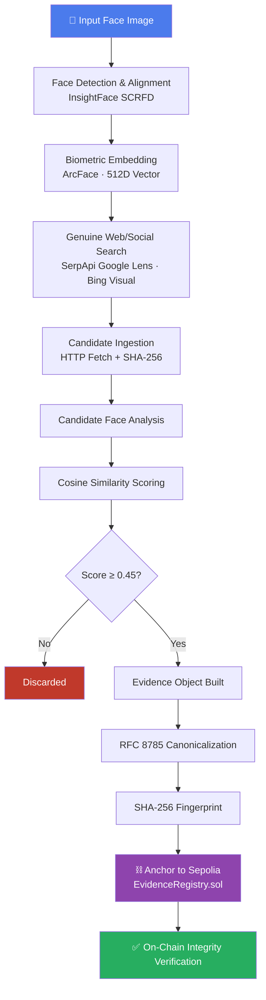

<div align="center">

# 🔍⛓️ FaceTrace

### Biometric Provenance • Reverse-Image Discovery • Tamper-Evident Blockchain Verification

*Built for HH Goa 2026 — Shortlisting Task 3*

<br/>


</div>

<br/>

> **FaceTrace** takes a single consented face image and turns it into a fully-verified, cryptographically-anchored evidence trail — from **biometric embedding** → **genuine reverse-image web search** → **similarity scoring** → **SHA-256 fingerprinting** → **on-chain anchoring on Ethereum Sepolia**.
>
> AI does the *matching*. The blockchain does the *proving*. Neither claims to do the other's job.

<br/>

---

## 📑 Table of Contents

- [Why FaceTrace](#-why-facetrace)
- [Architecture at a Glance](#-architecture-at-a-glance)
- [Pipeline Walkthrough](#-pipeline-walkthrough)
- [Module Map](#-module-map)
- [Tech Stack](#-tech-stack--why)
- [Quickstart](#-quickstart)
- [Evidence & Blockchain Layer](#-evidence--blockchain-layer)
- [Search Modes](#-search-modes)
- [Hardening & Failure Matrices](#-hardening--failure-matrices)
- [Ethical Boundaries](#-ethical-boundaries--limitations)
- [Security & Privacy](#-security--privacy)
- [License](#-license)

---

## 💡 Why FaceTrace

Reverse face search tools exist. Blockchain provenance tools exist. What's missing is the **bridge that keeps them honest with each other**:

| Problem | FaceTrace's Answer |
|---|---|
| "Is this match real, or fabricated after the fact?" | Every evidence bundle is hashed and anchored **before** it can be altered — any later tampering breaks the hash. |
| "Are you storing my face on a public ledger?" | **Never.** Only a 32-byte SHA-256 fingerprint touches the chain — zero embeddings, zero raw images. |
| "Is this scraping private accounts?" | No. FaceTrace only queries legitimate public search APIs (Google Lens / Bing Visual) — no login bypass, no ToS violations. |
| "Can I trust the similarity score?" | It's presented as what it is — a **probabilistic vector distance**, never framed as legal identity proof. |

---

## 🏗️ Architecture at a Glance



---

## 🔄 Pipeline Walkthrough

<table>
<tr><td width="60"><b>01</b></td><td><b>Detect & Align</b> — SCRFD locates the face and 5 landmarks.</td></tr>
<tr><td><b>02</b></td><td><b>Embed</b> — ArcFace produces a normalized 512-D biometric vector.</td></tr>
<tr><td><b>03</b></td><td><b>Search</b> — Genuine reverse-image query via SerpApi (Google Lens) or Bing Visual Search.</td></tr>
<tr><td><b>04</b></td><td><b>Ingest Candidates</b> — Download, validate, and SHA-256 every candidate image.</td></tr>
<tr><td><b>05</b></td><td><b>Score</b> — Cosine similarity between query and candidate embeddings.</td></tr>
<tr><td><b>06</b></td><td><b>Filter</b> — Keep only matches scoring ≥ <code>0.45</code>.</td></tr>
<tr><td><b>07</b></td><td><b>Build Evidence</b> — URL, platform, hash, score, timestamp → one deterministic object.</td></tr>
<tr><td><b>08</b></td><td><b>Canonicalize</b> — Sorted keys, NFC-normalized strings, fixed float precision (RFC 8785).</td></tr>
<tr><td><b>09</b></td><td><b>Fingerprint</b> — 32-byte SHA-256 digest of the canonical evidence.</td></tr>
<tr><td><b>10</b></td><td><b>Anchor</b> — <code>EvidenceRegistry.recordEvidence()</code> on Sepolia.</td></tr>
<tr><td><b>11</b></td><td><b>Verify</b> — Recompute locally, compare on-chain — flags <code>TAMPERED</code> on any mismatch.</td></tr>
</table>

---

## 🗂️ Module Map

```
FaceTrace/
├── contracts/               ⛓️  EvidenceRegistry.sol — Sepolia smart contract
├── src/
│   ├── core/                ⚙️  config, exceptions, logging, domain types
│   ├── face/                🧠  detection + embedding + cosine similarity
│   ├── search/               🌐  SearchProvider abstraction (SerpApi / Bing)
│   ├── candidates/           📥  fetch, validate, rank candidate matches
│   ├── evidence/              🧾  canonical JSON + SHA-256 evidence models
│   ├── blockchain/            🔗  Web3 provider + contract ABI
│   ├── verification/          ✅  independent on-chain re-verification
│   └── pipeline/               🏭  end-to-end orchestrator
├── app/app.py                🖥️  Streamlit interactive demo
├── tests/                     🧪  83 tests across every module
├── scripts/                   🩺  check_env.py · deploy_contract.py · audit_phase6.py
└── docs/                       📖  judge-friendly Phase 3 deep-dive
```

---

## 🧰 Tech Stack & Why

| Layer | Technology | Why |
|---|---|---|
| Face Detection & Embedding | **InsightFace** (SCRFD + ArcFace), ONNX Runtime | 99.8% LFW accuracy, no `dlib` C++ build headaches |
| Reverse Search | **SerpApi** (Google Lens) / Bing Visual | Only legitimate way to reverse-search public social posts |
| Canonicalization | Python `hashlib` + RFC 8785 | Bitwise-identical hashes across machines & languages |
| Blockchain | **Ethereum Sepolia**, `web3.py`, `eth-account` | Widely supported EVM testnet, free read calls |
| UI | **Streamlit** | Fast, clean, judge-friendly interactive demo |
| Config | **Pydantic Settings** | Type-safe env loading + automatic secret redaction |

---

## 🚀 Quickstart

```bash
# 1. Clone & enter
git clone https://github.com/Omrawat11/FaceTrace.git
cd FaceTrace

# 2. Virtual environment
python -m venv venv
source venv/bin/activate        # Windows: .\venv\Scripts\Activate.ps1

# 3. Install
pip install --upgrade pip
pip install -r requirements.txt

# 4. Configure secrets
cp .env.example .env            # then fill in your keys — never commit this file

# 5. Sanity check your environment
python scripts/check_env.py

# 6. Run the test suite
pytest -v

# 7. Deploy the local EvidenceRegistry contract
python scripts/deploy_contract.py

# 8. Run the full pipeline demo
python scripts/demo_phase3.py

# 9. Launch the interactive app
streamlit run app/app.py
```

---

## ⛓️ Evidence & Blockchain Layer

<details>
<summary><b>📄 Sample Evidence Record (click to expand)</b></summary>

```json
{
  "post_url": "https://instagram.com/p/C_abc123xyz/",
  "platform": "instagram",
  "title": "Jane Doe (@janedoe) • Instagram portrait photo (Match 01)",
  "image_sha256": "3fd9c94c5ea2ba4cbf8aa531502f7f1da450901f3f45225ab84fd3b6c95399a6",
  "similarity_score": 1.0,
  "threshold": 0.45,
  "discovered_at": "2026-09-01T18:45:28Z",
  "evidence_version": "1.0.0",
  "caption": "Verified public matching social portrait."
}
```

</details>

**Two hashes, two jobs:**

| Hash | Proves |
|---|---|
| `image_sha256` | Bitwise integrity of the raw candidate image file |
| `evidence_sha256` | Integrity of the *entire bundle* — URL, platform, score, threshold, timestamp — bound together |

**On-chain, forever, and nothing else:**

```solidity
struct EvidenceRecord {
    bytes32 fingerprint;   // SHA-256 of canonical evidence
    address recorder;      // who submitted it
    uint256 timestamp;     // block time
    uint256 blockNumber;
    string  sourceUrl;     // public discovery URL
}
```

🚫 No raw faces. 🚫 No embeddings. 🚫 No personal identifiers — ever.

```bash
# 24-point Phase 3 blockchain test suite
python -m pytest tests/test_phase3_blockchain.py -v

# Full suite — 83 tests
python -m pytest -v
```

---

## 🌐 Search Modes

| Mode | Trigger | Behavior |
|---|---|---|
| 🧪 **Demo** | `SEARCH_PROVIDER=mock` | Offline sample data — no API key needed, labeled `LOCAL DEMO` |
| 🌍 **Live** | `SEARCH_PROVIDER=serpapi` | Real Google Lens search over public indexed pages, labeled `LIVE WEB SEARCH` |

```env
SERPAPI_API_KEY=your_key_here
SEARCH_PROVIDER=serpapi
MAX_CANDIDATES=20
```

---

## 🛡️ Hardening & Failure Matrices

FaceTrace has been stress-tested against real-world failure modes so it doesn't fall over mid-demo:

- **Face Input** — rejects zero-face, multi-face, sub-32px, and corrupt images with named exceptions
- **Search Failures** — gracefully handles 401 / 429 / 500, timeouts, DNS errors, malformed JSON, empty results
- **Candidate Processing** — survives 404s, dropped connections, faceless candidates, and malformed URLs
- **Deduplication** — identical URLs collapse to one candidate; same image on different platforms is preserved
- **Tamper Detection** — any field mutation (even `0.82 → 0.83`) flips the fingerprint entirely and flags `✗ TAMPERED`

```bash
python scripts/audit_phase6.py
```

---

## ⚖️ Ethical Boundaries & Limitations

> FaceTrace is transparent about what it **can't** do:

- Only discovers **publicly indexed** content — no private accounts, no DMs, no walled gardens
- Search coverage is bounded by the provider (SerpApi / Google Lens) — recent or unindexed content may be missed
- Similarity score = **mathematical vector proximity**, not legal proof of identity
- Blockchain anchoring proves **existence & integrity at a timestamp** — not a real-world identity adjudication
- Lighting, angle, occlusion, and aging can affect match accuracy (false positives/negatives are possible)

---

## 🔐 Security & Privacy

- ✅ Zero biometrics ever touch the public ledger
- ✅ `.env` secrets auto-redacted in all logs
- ✅ `.gitignore` shields credentials from commits
- ✅ Respects `robots.txt` and public access boundaries — no bypass, ever
- ✅ Consent-first: demo images are either consented or public-figure test data

---

## 📜 License

Released under the **MIT License**. Built for **HH Goa 2026 — Shortlisting Task 3**.

<div align="center">

**⭐ If this project is useful, consider starring the repo — it helps a lot.**

</div>
